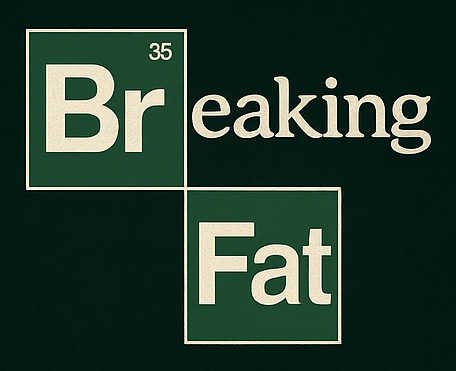

## Projeto 2VA SD
Projeto referente à 2VA da cadeira de Sistemas Distribuídos.

Este projeto utiliza Python com framework Django nos módulos do back-end, e JavaScript + HTML + CSS no front-end. Cada módulo será um serviço, sendo que cada serviço roda em um container docker, interagindo entre si através de requisições HTTP, assim tendo uma arquitetura análoga à de microsserviços.


### Breaking Fat


Breaking Fat é um sistema de gerenciamento de academia, nele os alunos e professores da academia podem se cadastrar para gerenciar seus exercícios e treinos.

### Como rodar o projeto
Para rodar basta abrir o terminal e executar os seguintes comandos:
1. Construir imagens docker (só na primeira vez)
```
docker-compose build
```

2. Criar/Subir os containers
```
docker-compose up
```

3. Parar os containers
```
docker-compose down
```

4. Rebuildar containers (opcional, reconstrói imagens e reinicia containers)
```
docker-compose up --build
```